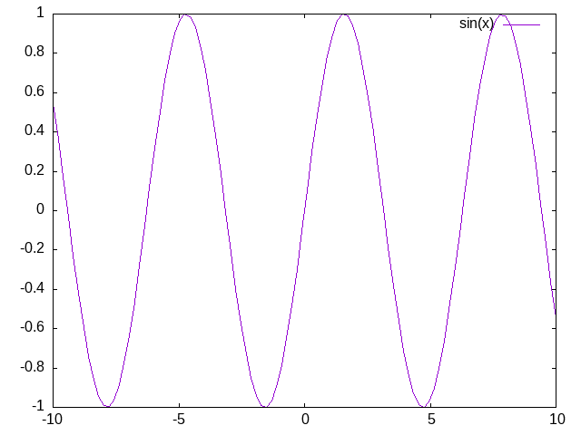
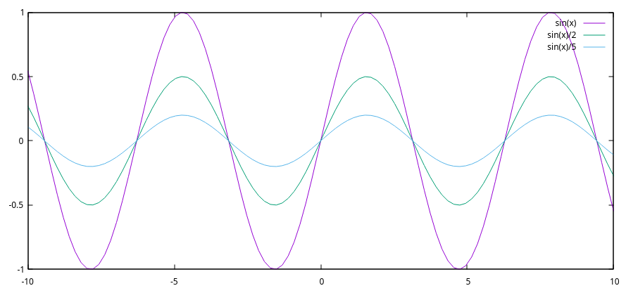
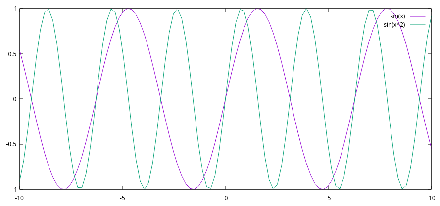

* 21.feb

## Na zaciatku bol sinus


John Cage (Silence)
Noam Chomsky.
4'33 - pocuvanie, analyza, partitura,
Nora Skuta - Sonaty a interuldia pre preparovany klavir

## Co je ticho?
## Co je zvuk ?
Najjednoduchšia zvuková vlna je *sínus*. Je preto považovaná za základný kameň počítačovej hudby. Sínus nemá v sebe žiadne ďalšie frekvencie (ako je to u iných vĺn), preto je sám o sebe zvukovo/hudobne nezaujímavý.

```supercollider
s.boot;
s.scope;
{SinOsc.ar(1000)}.plot;
```


### Hlasitost / Amplituda



```supercollider
Ndef(\a,{ SinOsc.ar(200) * MouseY.kr(0,1) ! 2 }).play
Ndef(\a).stop
```


### Vyska / frekvencia Hz (hertz)
Ľudské ucho/mozog je schopné zachytiť frekvencie z rozsahu ```<20,20000>``` Hz. Všetko nad týmto rozsahom nazývame ultrazvuk, pod infrazvuk. Čím sme starší, alebo často vystavení hlučnému prostrediu, tým sa tento rozsah znižuje.

|          |             |
| -------- | ----------- |
| Človek   | 20Hz-20kHz  |
| Šimpanz  | 100Hz-20kHz |
| Mačka    | 30Hz-50kHz  |
| Zajac    | 300Hz-45kHz |
| Myš      | 1kHz-100kHz |



```supercollider
Ndef(\a,{ SinOsc.ar(MouseX.kr(5,20000).poll) * 0.5 ! 2 }).play
Ndef(\a,{ Saw.ar(MouseX.kr(5,200)) * (0.5) ! 2 }).play
Ndef(\a).stop
```


```supercollider
Ndef(\a,{ SinOsc.ar(80) * 0.5 ! 2 }).play
Ndef(\a).stop
```

### farba
```supercollider
Ndef(\a,{ Saw.ar(200) * MouseY.kr(0,1) ! 2 }).play
Ndef(\a).stop
s.scope
```


// farba, amplituda
```supercollider
Ndef(\a,{ Saw.ar(200) * MouseY.kr(0,1) ! 2 }).play
Ndef(\a).stop
```

```supercollider
(
Ndef(\a,{
	SinOsc.ar(200)
	+ SinOsc.ar(300, mul: 0.5)
	+ SinOsc.ar(400, mul: 0.5)
	+ SinOsc.ar(600, mul: 0.5)
	+ SinOsc.ar(800, mul: 0.5)
 * 0.3 ! 2
}).play


)
```


```supercollider
(
{
	SinOsc.ar(200)
	+ SinOsc.ar(300, mul: 0.5)
	+ SinOsc.ar(400, mul: 0.5)
	+ SinOsc.ar(600, mul: 0.5)
	// + SinOsc.ar(800, mul: 0.5)
}.plot


)

```

```supercollider
{ Saw.ar(200) * -1 }.plot
s.scope

```supercollider
Ndef(\a,{SinOsc.ar(200) * 0.5}).play(out: 0)
Ndef(\a).stop


Ndef(\b,{SinOsc.ar(200.01) * 0.5 }).play(out: 1)
Ndef(\b).stop


{ SinOsc.ar(200) + SinOsc.ar(200.1)  }.plot(10)
```

//////////////////////////////////////
//////////////////////////////////////
